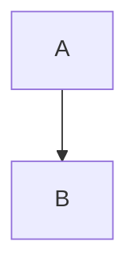

# VitePress Mermaid 解决方案指南

## 问题概述

VitePress 1.6.3版本在使用Mermaid图表时可能出现渲染问题。本文档提供了多种解决方案。

## 解决方案1：使用withMermaid包装器（推荐）

### 修复配置文件

将 `docs/.vitepress/config.mjs` 修改为：

```javascript
import { defineConfig } from 'vitepress'
import { withMermaid } from 'vitepress-plugin-mermaid'

export default withMermaid(
  defineConfig({
    title: 'VitePress Mermaid Test',
    description: 'Testing Mermaid integration',
    // 可选：添加mermaid配置
    mermaid: {
      theme: 'default'
    },
    // 可选：添加vite配置以解决依赖问题
    vite: {
      optimizeDeps: {
        include: ['mermaid']
      }
    }
  })
)
```

### 重新安装依赖

```bash
cd vptest
npm install
```

## 解决方案2：版本兼容性修复

### 调整依赖版本

修改 `package.json` 中的依赖版本：

```json
{
  "dependencies": {
    "mermaid": "^10.9.0",
    "vitepress": "^1.6.3",
    "vitepress-plugin-mermaid": "^2.0.17"
  }
}
```

### 清理并重新安装

```bash
cd vptest
rm -rf node_modules package-lock.json
npm install
```

## 解决方案3：自定义Vue组件

如果插件方法仍然不工作，可以使用自定义Vue组件：

### 1. 创建主题配置

创建 `docs/.vitepress/theme/index.js`：

```javascript
import DefaultTheme from 'vitepress/theme'
import Mermaid from './components/Mermaid.vue'

export default {
  extends: DefaultTheme,
  enhanceApp({ app }) {
    app.component('Mermaid', Mermaid)
  }
}
```

### 2. 创建Mermaid组件

创建 `docs/.vitepress/theme/components/Mermaid.vue`（已在项目中创建）

### 3. 在Markdown中使用

```markdown
<Mermaid :code="'flowchart TD\n    A --> B\n    B --> C'" />
```

## 解决方案4：内联JavaScript方法

在需要Mermaid的页面中添加：

```markdown
<script setup>
import { onMounted } from 'vue'

onMounted(async () => {
  const mermaid = await import('mermaid')
  mermaid.default.initialize({ startOnLoad: true })
})
</script>


```

## 解决方案5：使用CDN加载

在 `docs/.vitepress/config.mjs` 中添加：

```javascript
export default defineConfig({
  head: [
    ['script', { src: 'https://cdn.jsdelivr.net/npm/mermaid@10/dist/mermaid.min.js' }]
  ]
})
```

## 测试步骤

1. 选择一个解决方案
2. 应用相应的配置
3. 运行开发服务器：
   ```bash
   npm run dev
   ```
4. 访问 `http://localhost:5173` 查看结果

## 故障排除

### 常见问题

1. **"Cannot resolve 'mermaid'"**: 确保mermaid已正确安装
2. **"Uncaught SyntaxError"**: 检查版本兼容性
3. **图表不显示**: 确认配置文件语法正确

### 调试建议

1. 检查浏览器控制台错误
2. 确认所有依赖已正确安装
3. 尝试降级到兼容版本
4. 清理缓存后重试

## 推荐方案

**方案1（withMermaid包装器）** 是最推荐的解决方案，因为：
- 官方支持
- 配置简单
- 功能完整

如果方案1不工作，建议尝试**方案2（版本兼容性修复）**。

**方案3（自定义组件）** 适用于需要更多控制的场景。

## 备注

- 确保在生产环境中测试所有解决方案
- 定期更新依赖以获取最新修复
- 考虑使用其他图表库作为备选方案（如D3.js、Chart.js等）