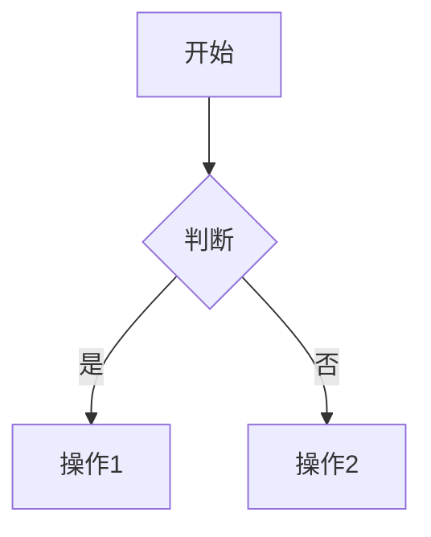
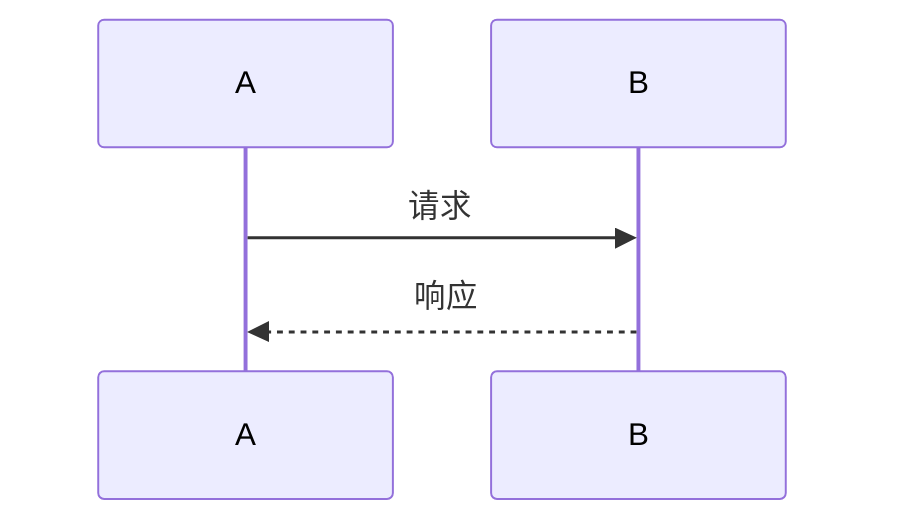

# 基础语法
| 效果 | 语法 | 示例 |
|------|------|------| 
| 粗体 | **文字** | **重要内容** | 
| 斜体 | *文字* | *强调内容* | 
| 代码 | `代码` | `console.log()` | 
| ~~删除线~~ | ~~文字~~ | ~~过时内容~~ | 
| 链接 | [文字](URL) | [GitHub](https://github.com) | 
||  |  |

# 列表语法
## 无序列表
- 项目1
- 项目2
  - 子项目

## 有序列表  
1. 第一项
2. 第二项

## 任务列表
- [x] 已完成
- [ ] 未完成


# 代码语法
## 行内代码
使用 `npm install` 安装包

## 代码块
```javascript
function hello() {
    console.log("Hello World!");
}


```
## 带语言高亮
```bash
npm run build
```

# 表格语法
| 列1 | 列2 | 列3 |
|-----|:---:|----:|
| 左对齐 | 居中 | 右对齐 |
| 内容1 | 内容2 | 内容3 |

# VitePress 特色语法

# 信息框
::: tip 提示
这是一个提示框
:::

::: warning 警告
这是一个警告框
:::

::: danger 危险
这是一个危险警告框
:::

::: details 点击展开
这是可折叠内容
:::

# Mermaid 图表
# 流程图


# 时序图


# Frontmatter (文章头部)

---
title: "文章标题"
date: 2025-01-04
author: "作者"
tags: 
  - 标签1
  - 标签2
description: "文章描述"
---

# 文章正文开始

# 实用写作模板
## 技术文章模板

---
title: "技术文章标题"
date: 2025-01-04
author: CimaStone
tags: [技术, 教程]
---

# 技术文章标题

## 🎯 背景
简要说明为什么写这篇文章

## 🔧 环境准备
- 前置条件
- 安装步骤

## 📝 详细步骤

### 步骤1：准备工作
```bash
# 代码示例
npm install

::: tip 提示 重要提示信息 :::

步骤2：具体实现
详细说明...

🔍 常见问题
问题1： 解决方案
问题2： 解决方案
🎉 总结
总结要点

### 学习笔记模板

```markdown
---
title: "学习笔记：主题"
date: 2025-01-04
tags: [学习笔记, 主题]
---

# 学习笔记：主题

## 📖 学习目标
- [ ] 目标1
- [ ] 目标2

## 📝 重点知识

### 知识点1
解释...

### 知识点2  
解释...

## 💡 代码示例
```language
// 示例代码

🤔 疑问记录
疑问： 问题描述
解答或思考
📋 总结
✅ 已掌握：内容1
⏳ 待深入：内容2
🔗 参考资源
链接1
链接2


## 🎨 美化技巧

### 使用 Emoji 让文章更生动

```markdown
# 📚 学习笔记
## 🚀 快速开始  
## ⚠️ 注意事项
## 🎯 核心要点
## 💡 最佳实践
## 🔧 配置说明
## 📝 总结
使用引用突出重点
> 💡 **重要提示：** 这是一个重要的提示信息

> ⚠️ **注意：** 这里需要特别注意

> 🎯 **核心概念：** 关键概念的解释
使用分隔线组织内容
## 第一部分
内容...

---

## 第二部分  
内容...

---

## 总结
内容...


