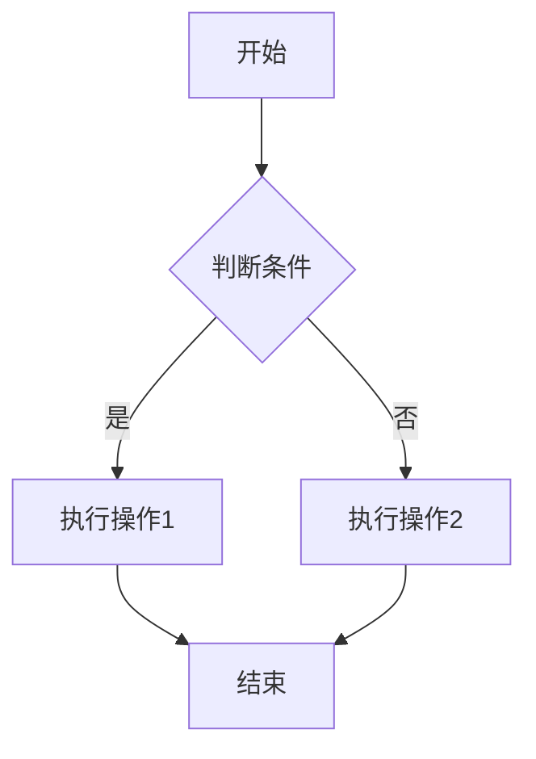
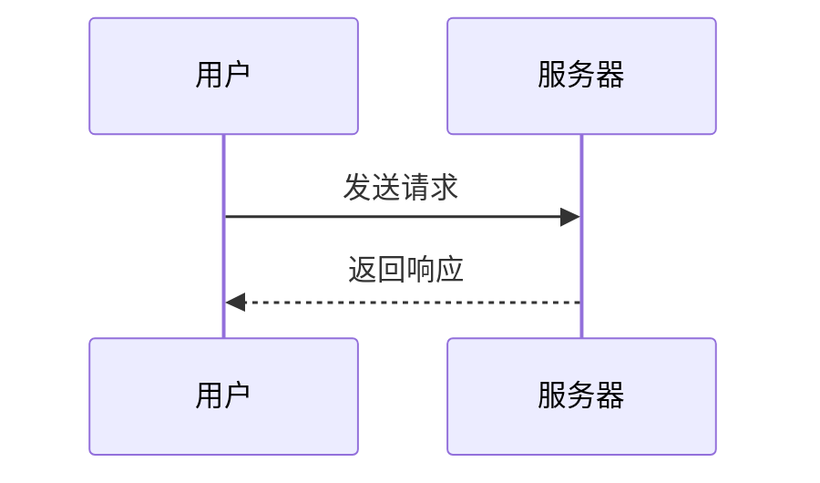
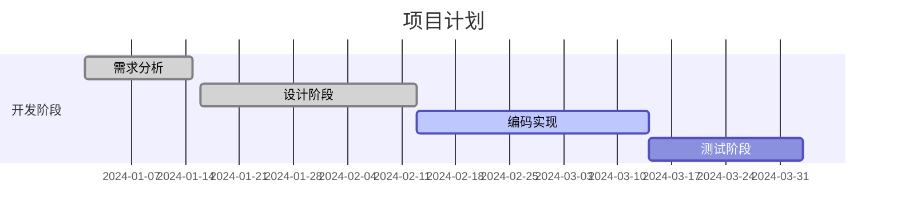

# Markdown 语法指南

这是一个完整的Markdown语法参考，涵盖了在VitePress博客中常用的所有语法。

## 📖 基础语法

### 标题 Headers

```markdown
# 一级标题 (H1)
## 二级标题 (H2)
### 三级标题 (H3)
#### 四级标题 (H4)
##### 五级标题 (H5)
###### 六级标题 (H6)
```

### 文本样式 Text Styling

```markdown
**粗体文字**
*斜体文字*
***粗斜体文字***
~~删除线文字~~
`行内代码`
<u>下划线文字</u>
<mark>高亮文字</mark>
```

**效果展示：**
**粗体文字**  
*斜体文字*  
***粗斜体文字***  
~~删除线文字~~  
`行内代码`  
<u>下划线文字</u>  
<mark>高亮文字</mark>

### 段落和换行

```markdown
这是第一个段落。

这是第二个段落。

这是一行文字，  
这里有两个空格换行。
```

### 分隔线

```markdown
---
***
___
```

---

## 📝 列表 Lists

### 无序列表

```markdown
- 项目1
- 项目2
  - 子项目2.1
  - 子项目2.2
    - 子子项目2.2.1
- 项目3

* 也可以用星号
 或者加号
```

### 有序列表

```markdown
1. 第一项
2. 第二项
   1. 子项目2.1
   2. 子项目2.2
3. 第三项

1. 数字会自动排序
1. 所以这里写1也没关系
1. 会自动变成3
```

### 任务列表

```markdown
- [x] 已完成的任务
- [ ] 未完成的任务
- [x] 另一个已完成的任务
```

## 🔗 链接和图片

### 链接

```markdown
[链接文字](https://example.com)
[带标题的链接](https://example.com "鼠标悬停显示的标题")
<https://example.com> (自动链接)
[相对路径链接](./other-page.md)
[锚点链接](#标题)
```

### 图片

```markdown


<!-- 可调整大小的图片 (HTML语法) -->

```

### 引用式链接

```markdown
这是一个[引用式链接][1]，还有一个[引用链接][link]。

[1]: https://example.com
[link]: https://github.com "GitHub"
```

## 💻 代码 Code

### 行内代码

```markdown
使用 `console.log()` 输出内容。
```

### 代码块

````markdown
```javascript
function hello() {
    console.log("Hello, World!");
}
```

```python
def hello():
    print("Hello, World!")
```

```bash
# 这是一个shell命令
npm install vitepress
```
````

### 带行号的代码块

````markdown
```javascript{1,3-5}
function hello() {
    console.log("Hello");  // 高亮第1行
    const name = "World";  // 高亮第3-5行
    const message = `Hello, ${name}!`;
    return message;
}
```
````

## 📊 表格 Tables

```markdown
| 左对齐 | 居中对齐 | 右对齐 |
| :--- | :---: | ---: |
| 内容1 | 内容2 | 内容3 |
| 长一点的内容 | 短内容 | 更长的内容 |
```

效果：
| 左对齐 | 居中对齐 | 右对齐 |
| :--- | :---: | ---: |
| 内容1 | 内容2 | 内容3 |
| 长一点的内容 | 短内容 | 更长的内容 |

## 📋 引用 Blockquotes

```markdown
> 这是一个引用块。
> 
> 可以包含多行内容。
> 
> > 这是嵌套引用。

> **注意：** 引用块中也可以使用其他markdown语法。
```

## 🎨 VitePress 扩展语法

### 信息框 Info Boxes


::: info 信息
这是一个信息框
:::

::: tip 提示
这是一个提示框
:::

::: warning 警告
这是一个警告框
:::

::: danger 危险
这是一个危险警告框
:::

::: details 点击展开详情
这是一个可折叠的详情框
:::


### 自定义容器


::: info 自定义标题
可以自定义信息框的标题
:::

::: tip
可以不写标题
:::


### 代码组 Code Groups


::: code-group

```js [config.js]
export default {
  name: 'config'
}
```

```ts [config.ts]
export default {
  name: 'config'
} as const
```

:::


## 📐 数学公式 Math

### 行内公式

```markdown
这是行内公式：$E = mc^2$
```

### 块级公式

```markdown
$$
\sum_{i=1}^{n} i = \frac{n(n1)}{2}
$$
```

## 🎭 HTML 支持

Markdown支持HTML标签：

```html
<div style="color: red;">
  红色文字
</div>

<details>
<summary>点击展开</summary>
隐藏的内容
</details>

<kbd>Ctrl</kbd>  <kbd>C</kbd>
```

## 📈 图表支持 (Mermaid)

### 流程图

````markdown

````

### 时序图

````markdown

````

### 甘特图

````markdown

````

## 📄 文档元数据 Frontmatter

```markdown
---
title: "文章标题"
date: 2025-01-04
author: "作者名"
tags: 
  - 标签1
  - 标签2
categories:
  - 分类1
description: "文章描述"
cover: "./cover.jpg"
draft: false
---

# 文章内容开始
```

## 🎯 博客文章模板

### 技术文章模板

```markdown
---
title: "技术文章标题"
date: 2025-01-04
author: CimaStone
tags: 
  - 技术栈
  - 编程语言
  - 框架
description: "一句话描述文章内容"
---

# {{ title }}

## 🎯 背景

简要介绍为什么写这篇文章...

## 🔧 环境准备

### 前置条件

- [ ] 条件1
- [ ] 条件2

### 安装依赖

```bash
npm install package-name
```

## 📝 正文内容

### 步骤1：标题

详细说明...

```javascript
// 代码示例
console.log("Hello World");
```

::: tip 提示
这里是重要提示
:::

### 步骤2：标题

继续说明...

## 🔍 常见问题

### 问题1

**问题描述：** 描述问题

**解决方案：** 解决步骤

### 问题2

**问题描述：** 描述问题

**解决方案：** 解决步骤

## 📚 参考资料

- [参考链接1](https://example.com)
- [参考链接2](https://example.com)

## 🎉 总结

总结文章要点...

---

*最后更新：2025年1月4日*
```

### 学习笔记模板

```markdown
---
title: "学习笔记：主题"
date: 2025-01-04
author: CimaStone
tags: 
  - 学习笔记
  - 主题标签
description: "学习XX的笔记记录"
---

# {{ title }}

## 📖 学习目标

- [ ] 目标1
- [ ] 目标2
- [ ] 目标3

## 📝 重点知识

### 知识点1

解释说明...

### 知识点2

解释说明...

## 💡 代码示例

```language
// 示例代码
```

## 🤔 疑问记录

1. **疑问1：** 问题描述
   - 解答或思考

2. **疑问2：** 问题描述
   - 解答或思考

## 📋 总结

### 已掌握

- ✅ 掌握点1
- ✅ 掌握点2

### 待深入

- ⏳ 需要深入的点1
- ⏳ 需要深入的点2

## 🔗 相关资源

- [官方文档](https://example.com)
- [教程链接](https://example.com)

---

*学习日期：2025年1月4日*
```

## 🚀 快速参考

### 常用快捷方式

| 效果 | 语法 |
|------|------|
| **粗体** | `**文字**` |
| *斜体* | `*文字*` |
| `代码` | `` `代码` `` |
| [链接](.) | `[文字](URL)` |
|  | `` |

### VitePress特色功能

| 功能 | 语法 |
|------|------|
| 信息框 | ::: info |
| 提示框 | ::: tip |
| 警告框 | ::: warning |
| 详情框 | ::: details |

---
