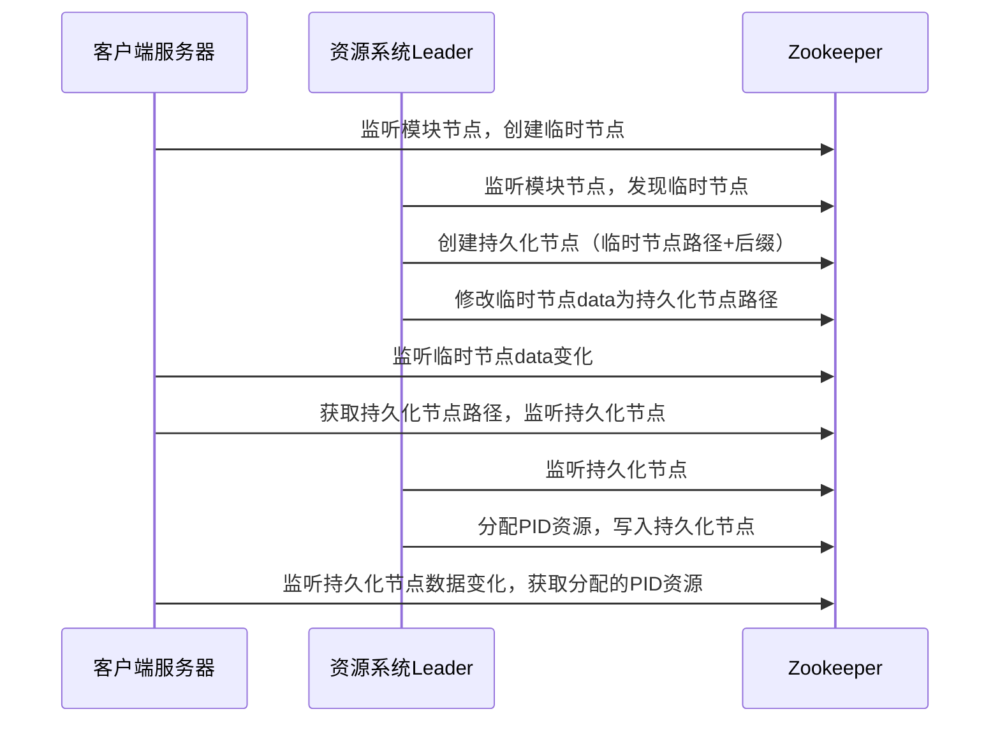
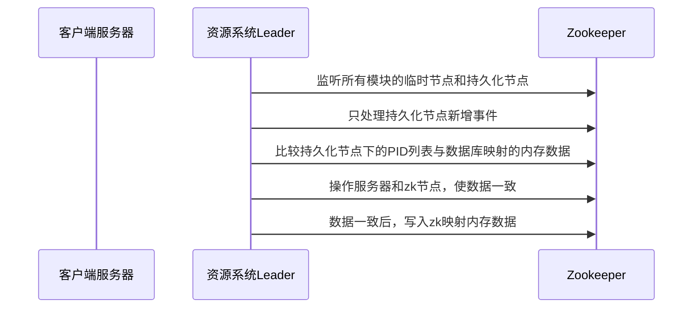
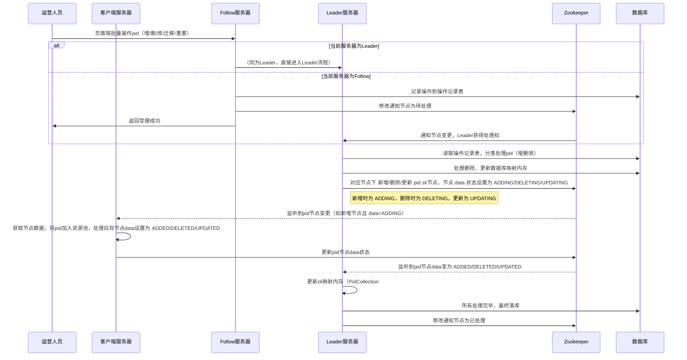
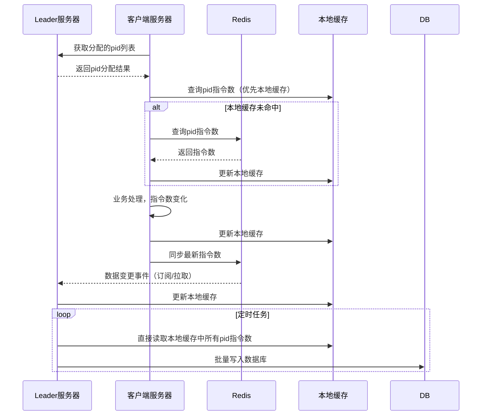
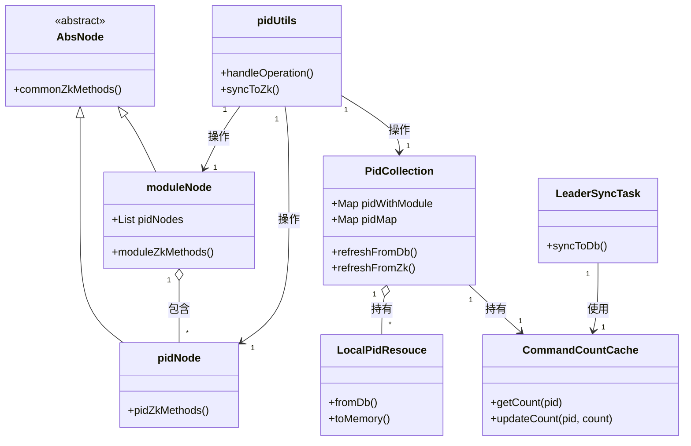

# 资源系统-服务端
## 🎯 背景与目标
> 本系统旨在高效管理第三方平台账户（PID），实现业务系统对账户资源的合理分配、动态调整与实时监控，避免资源浪费和成本增加。

**背景**：业务系统获取业务信息需从第三方平台获取，第三方平台以账户形式进行售卖，业务人员通过账户进行密码登录，输入行业业务指令获取资源数据，也可以通过系统交互的方式进行登录发送指令请求；账户资源有以下要求：
1. 每个账户的发起指令数量有限（数量/月），超出月租数量以阶梯式收费
2. 每个账户同一时间只能在一个终端进行登录，同时在多个终端登录会被中断连接，频繁会使账户资源冻结
3. 业务系统/资源系统都为集群部署，现业务采购1000个账户，有不同的部门不同的模块对应的业务系统都需要使用该批资源

**目标**：
  1. 将1000个账户根据业务模块及各业务所需指令数进行合理分配账户，承接业务需求
  2. 实时监控每个账户指令使用情况，动态调整每个模块&系统所分配的账户资源，最大利用账户资源，避免增加额外费用

## 统一语言
| 名称 | 含义 |
| :---: | :---: |
| pid | 第三方平台的单个账户|
| 资源系统 | 管理、分配和动态调整pid的系统 |
| 客户端 | 需要使用pid的业务系统 |
| 客户端服务器 | 需要使用pid的业务系统#某台服务器 |
| 模块 | 需要使用pid的业务系统所属模块 |
| 通知节点 | 资源系统follow服务器收到pid调度请求时，follow不能操作节点，只能把该请求插入操作记录表，并改动zk通知节点data数据为待处理（DEALING） |

## 🔧 核心流程与控制点
### 资源系统集群服务启动leader服务器启动流程（首次获取leader｜follow -> leader）
#### 流程说明
- 采用Zookeeper进行Leader选举，确保资源分配的唯一性和一致性。
- Leader服务器负责初始化数据、分配PID资源并监听各业务模块节点。
- 非Leader（Follow）服务器仅接收请求并转发操作记录。
#### 详细设计
1. 需要只有一台服务器的对资源进行分配操作 && 操作zk节点通知客户端，采用zk 选举leader,非leader服务器接收业务操作人员请求后，会将请求内容转换为操作记录表
2. leader服务器被通知成为leader后：
   - 将通知节点对应的data数据改为已处理（DEALED），操作记录表数据改为已处理
   - 设置node属性isLeader == true
   - 清理数据库映射的内存数据（PidCollection#pidWithModule） && zk 映射的内存数据（PidCollection#pidMap）
   - 读取数据库数据初始化内存数据（PidCollection#pidWithModule）
   - 根据模块系统预先设定的服务器数量将分配给该模块的pid集合进行预分批
   - 检查模块路径是否在zk生成节点，已生成则监听，未生成，创建并监听

```
[资源系统集群服务启动]
 └─> ZK发起Leader选举
      ├─ Leader服务器被选举
      │    ├─ 初始化内存数据
      │    ├─ 分配PID资源
      │    └─ 监听模块节点
      └─ Follow服务器
           └─ 只接收操作请求，不分配资源
```    
         
### 客户端服务器启动与资源系统交互（客户端zk节点未创建）
#### 流程说明
1. 资源系统leader服务器启动时监听模块节点
2. 客户端服务器启动时会监听所配置的模块节点，并在模块节点下创建临时节点
3. 资源系统leader服务器监听到临时节点后
   - 生成持久化节点的zk路径（临时节点路径 + 固定后缀）
   - 根据持久化节点路径创建zk节点
   - 修改临时节点data值为持久化节点路径
4. 客户端服务器监听到临时节点数据有变化，获取data数据，并监听持久化节点
5. 资源系统leader服务器监听到创建的持久化节点后，，从数据库映射的内存数据（PidCollection#pidWithModule）选取一份`List<pidModle>`批量放入该持久化节点的子路径中，并监听每个pid zk节点



### 客户端服务器启动与资源系统交互流程（客户端zk节点已创建）
1. 资源系统leader服务器启动时监听模块节点
2. 监听到所有模块下的临时节点和持久化节点事件，只处理持久化节点新增事件
3. 将持久化节点（模块）下的List```<Pid>```与数据库映射的内存数据（PidCollection#pidWithModule）进行比较，以数据库映射到的内存数据为准；**先操作服务器zk pid删除，再统一操作新增**，此处使用了CyclicBarrier
4. 当zk节点的数据与数据库映射的内存数据一致时，将数据写入zk 映射的内存数据（PidCollection#pidMap）
   


### 业务操作人员操作 PID 同步更新至客户端 — 流程说明

1. 业务操作人员发起操作
   - 在页面端针对某个模块批量新增、更新、删除 pid，或将部分 pid 从 A 模块迁移到 B 模块，或重置指令数等。
2. 请求到资源系统
   - 若当前服务器为 Leader：
     1. 分类整理要处理的 pid 列表（需新增、删除、更新等）。
     2. 先处理删除，更新数据库映射的内存数据。
     3. 操作 zk 节点，成功后同步 zk 映射内存。
     4. 处理新增，根据客户端服务器数量进行预分配并同步数据库映射内存。
     5. 操作 zk 节点，成功后同步 zk 内存。
     6. 更新操作同步数据库和 zk 内存。
     7. 所有处理完毕后，最终落库。
   - 若当前服务器为 Follow：
      1. 操作转为操作记录表（按批次号记录）。
      2. 变更通知节点状态，通知 Leader 处理。
      3. Follow 服务器直接响应“受理成功”。
      4. Leader 服务器收到通知后，按 Leader 流程处理。
      5. 处理完成后，更新通知节点状态为已处理。
   - 客户端服务器同步更新
     1. 服务端（Leader）在 zk 客户端服务器节点下新增 pid 节点，data 状态设置为 `ADDING`。
     2. 客户端监听到新增 pid 节点，获取数据后将 PID 加入本地资源池，并将该节点状态更新为 `ADDED`。
     3. 服务端监听到状态变为 `ADDED`，更新 zk 映射内存（PidCollection#pidMap）。
     4. 更新、删除操作同理，均通过状态字段流转保证一致性与原子性。


#### 补充说明
**操作记录表**：Follow 服务器将每一批次操作详细记录，确保流程可追溯、可重试。  
**通知机制**：通过 zk 通知节点，确保 Leader 可靠接管并执行实际操作，避免多 Leader 或并发冲突。  
**分批预分配**：新增 pid 会根据客户端服务器数均匀分配，最大化资源利用。  
**一致性保障**：所有数据操作（数据库、zk、本地缓存）均有步骤同步校验，防止数据不一致。  
**客户端自动化**：客户端无需人工介入，监听 zk 变更即可自动完成本地资源池的同步更新。  
**状态流转保障一致性**：每次资源变更由服务端主导，客户端实际落地，状态字段（如 ADDING, ADDED）作为分布式事务的简单二阶段提交，确保无中间态残留。  
**支持横向扩展**：流程天然支持客户端服务器横向扩展，任何节点的增删都能被 Leader/zk 感知并安全同步到集群。  
**异常自恢复**：如客户端或网络异常导致同步失败，通过 zk 节点状态可自动补偿/重试。  

### 客户端资源账户指令数同步资源服务器流程
#### 1. 流程说明
1. **客户端服务器获取分配到的 pid 列表**  
   客户端启动后，通过监听自身 zk 节点，获知当前所持有的 pid 账户资源。
2. **定期同步指令数使用情况**  
  客户端服务器根据每个 pid（userName），从 Redis 查询该账户的指令数使用情况。
3. **本地与分布式缓存协同**  
  Leader端和客户端均使用 RLocalCachedMap 结构，将 Redis 作为分布式缓存后端，提升访问效率并减轻 Redis 压力。
4. **指令数变更上报与下发**  
   客户端在处理业务指令时，实时更新本地缓存，并通过 Redis 机制将最新指令数同步至其他节点，保证数据一致。
5. **Leader端定期全量检查**  
   Leader 定时通过守护线程从本地缓存拉取所有账户的指令数，确保全局视图统一，并可做监控与告警

#### 2. 流程图

#### 3. 核心代码
``` java
// Redisson本地缓存配置
LocalCachedMapOptions<String, Integer> options = LocalCachedMapOptions.<String, Integer>defaults()
    .cacheSize(10000)
    .evictionPolicy(EvictionPolicy.LRU)
    .syncStrategy(LocalCachedMapOptions.SyncStrategy.INVALIDATE) // 核心配置
    .reconnectionStrategy(LocalCachedMapOptions.ReconnectionStrategy.CLEAR);

// 业务系统服务器本地缓存：分配到的pid子集
RLocalCachedMap<String, Integer> clientCache = redisson.getLocalCachedMap("pid_command_count", options);

// 业务处理前
public boolean canProcess(String pid, int need) {
    Integer left = clientCache.get(pid);
    if (left == null) {
        // 可选：从Redis主动拉取
        left = redisTemplate.opsForValue().get("PID_COUNT:" + pid);
        if (left != null) pidCommandCountCache.put(pid, left);
    }
    // 超出则拒绝
    return left != null && left >= need;
}

// Leader本地缓存：所有pid
RLocalCachedMap<String, Integer> leaderCache = redisson.getLocalCachedMap("pid_command_count", options);

// 当A系统某台服务器有pid变化
clientCache.put(pid, newCount); // 自动同步至Redis，触发分布式通知

// Leader自动感知变化
Integer updatedCount = leaderCache.get(pid); // 自动失效/更新，无须主动拉取

// Leader批量写库
for (String pid : leaderCache.keySet()) {
    Integer count = leaderCache.get(pid);
    // 写入数据库
}
```

#### 4. 补充说明
**一致性保障**：客户端和Leader通过RLocalCachedMap+Redis保证数据最终一致，避免指令数统计延迟或丢失。  
**高性能**：优先命中本地缓存，大幅减少Redis压力  
**容灾与监控**：Leader定时全量拉取，异常时可触发告警。  
**灵活扩展**：支持横向扩展，客户端无需关心全局视图，Leader统一全局监控。  
**redis更新策略**： INVALIDATE 策略支撑超大规模、高变更场景，可极大降低广播量。但是如果通过本地缓存设计监听器的话，必须使用update策略，因为INVALIDATE策略是直接让本地缓存失效

### 核心类介绍  
| 名称 | 含义 |
| :---: | :--- |
| LocalPidResouce | 数据库数据和内存（PidCollection等）之间的数据映射、交互纽带|
| pidUtils | 处理运营人员页面操作（增删改pid），并同步变更到zk |
| PidCollection | id收集器，维护两大核心内存<br>1. pidWithModule（DB映射）<br>2. pidMap（zk节点映射） |
| moduleNode | 操作模块及客户端服务器（InstanceVo）zk节点的核心类，聚合若干pidNode |
| pidNode | 操作具体pid zk节点的核心类  |
| AbsNode | moduleNode与pidNode的父类，抽象出处理zk节点的公共方法  |
| CommandCountCache | 负责pid与指令数的本地缓存和分布式同步操作 |
| LeaderSyncTask | Leader节点定时任务：定期从本地缓存读取指令数，批量落库 |


#### 说明
- AbsNode 是 moduleNode 和 pidNode 的父类，封装了 ZK 节点的公共操作。
- moduleNode 聚合多个 pidNode，代表一个模块或服务器节点下的所有 pid 节点。
- PidCollection 维护两份核心内存映射（数据库映射、zk节点映射），并持有 LocalPidResouce 和 CommandCountCache。
- pidUtils 是业务操作入口，处理页面操作和同步到 zk，操作 PidCollection/moduleNode/pidNode。
- CommandCountCache 负责 pid 的指令数分布式缓存。
- LeaderSyncTask 作为 Leader 节点的定时批量落库任务，依赖 CommandCountCache。

## 🔍 常见问题
### 问题1 
**问题描述：** 操作 ZooKeeper 节点仅允许由 Leader 服务器进行处理。当运营人员在前端页面发起资源操作请求，并且该请求被路由到资源系统的 Follow 服务器时，如何确保操作被正确转发至 Leader 服务器执行业务处理，并同步作用到对应的客户端服务器  
**解决方案：**   
整体流程如下：
1. Follow 服务器接收到运营人员的操作请求后，将操作拆分并记录到操作记录表中。
2. Follow 服务器通知 Leader 服务器处理操作记录表中的任务。
3. Leader 服务器先更新数据库映射的本地内存数据。
4. Leader 通知关联的模块/系统/服务器对应的 ZooKeeper 节点，将节点 data 值设置为 ING（处理中）。
5. 客户端服务器监听到对应 pid 节点变更后，执行实际处理操作，处理成功后将节点值更新为“完成”状态。
6.Leader 服务器监听到节点状态变更后，刷新自身 ZooKeeper 映射的内存数据。
7.最终，Leader 服务器同步数据库，完成所有数据一致性操作。

### 问题2  
**问题描述：** 在客户端服务器宕机（down机）后，如何及时释放其占用的资源账户？当系统重启且由于 Docker 部署造成 IP 变化，原服务器和新服务器无法直接绑定时，如何实现资源账户的自动重新分配？  
**解决方案：** 
1. 在客户端服务器宕机（down机）后，如何及时释放其占用的资源账户？当系统重启且由于 Docker 部署造成 IP 变化，原服务器和新服务器无法直接绑定时，如何实现资源账户的自动重新分配？
2. 客户端服务器启动后，从 Leader 的内存分配池中领取自身的资源账户。
3. 客户端服务器启动后，从 Leader 的内存分配池中领取自身的资源账户。
4. Leader 服务器监听到 remove 事件后，删除 ZooKeeper 映射内存中该服务器的资源账户，并更新数据库映射的内存数据，将对应 InstanceVo 状态置为未分配，同时删除数据库中的该 Instance 数据。
5. 客户端服务器重启后，会重新监听模块节点，并在其下创建自己的临时节点。Leader 服务器据此创建对应的持久化节点，并从数据库映射的内存池中提取未分配的资源账户分配给新节点，完成 Instance 数据的新增和 pid 列表节点下发。
6. 客户端服务器完成资源账户登录后，更新 pid 节点状态为“完成”；Leader 服务器据此刷新 ZooKeeper 映射的内存数据，保障资源分配的一致性和自动化。

### 问题3  
**问题描述：** 客户端服务器是否支持动态扩容或缩容？在已分配资源的情况下，如何确保资源账户的平滑迁移和一致性？  
**解决方案：** 
1. 当前设计要求客户端服务器数量与资源系统中配置的模块/系统/服务器数量保持一致，Leader 服务器据此进行资源的内存预分配。
2. 若需支持动态扩缩容，Leader 服务器可实时感知客户端服务器数量变化，并根据实际分配情况重新分配资源账户。
3. 扩容/缩容流程如下：
   - Leader 服务器从数据库映射的内存数据和已分配客户端服务器的 `List<Pid>` 中回收部分资源账户。
   - 通过 ZooKeeper 操作相应数据节点，客户端服务器按要求释放资源，释放成功后 Leader 更新本地及 ZooKeeper 映射的内存数据。
   - 所有需回收资源账户的客户端服务器处理完成后，Leader 再将回收的资源账户分配给新增的客户端服务器。
   - 为新增服务器创建持久化节点和对应的 pid zk 节点，客户端服务器完成处理后，Leader 更新 ZooKeeper 映射的内存数据。
4. 以上流程保障了在动态扩缩容的场景下，资源账户的平滑迁移、分配和一致性。
