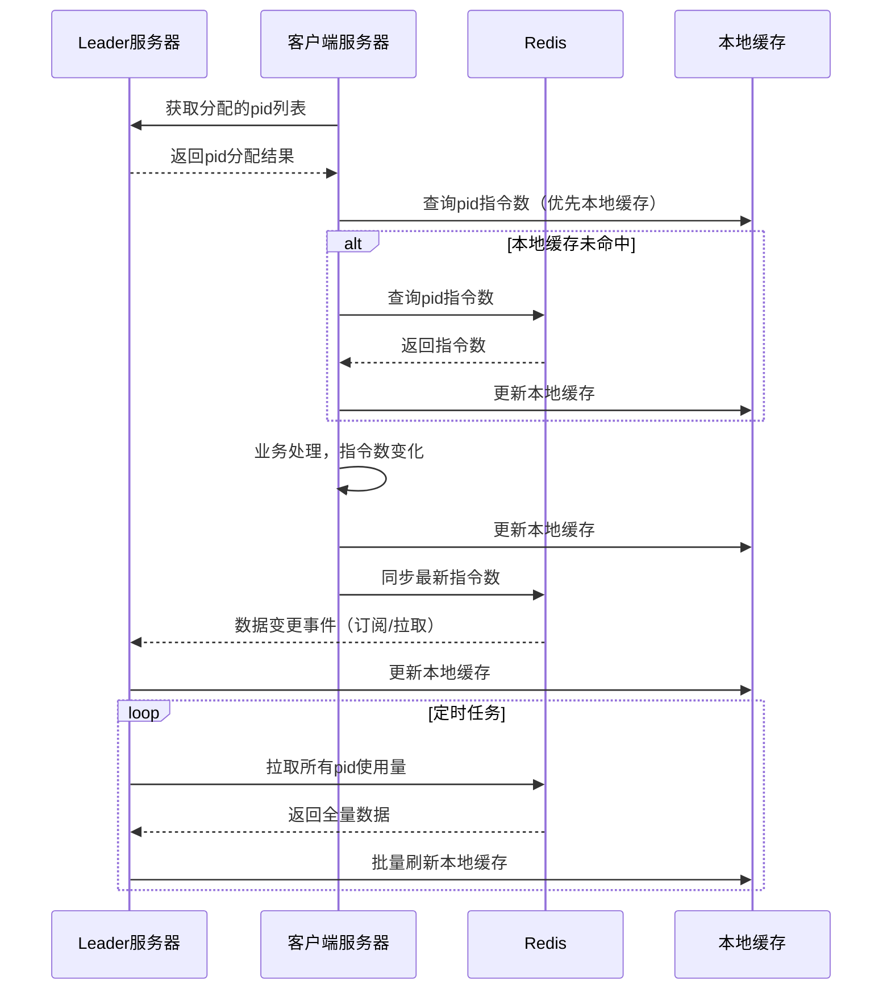

# 资源系统-服务端
## 🎯 背景与目标
> 本系统旨在高效管理第三方平台账户（PID），实现业务系统对账户资源的合理分配、动态调整与实时监控，避免资源浪费和成本增加。

**背景**：业务系统获取业务信息需从第三方平台获取，第三方平台以账户形式进行售卖，业务人员通过账户进行密码登录，输入行业业务指令获取资源数据，也可以通过系统交互的方式进行登录发送指令请求；账户资源有以下要求：
1. 每个账户的发起指令数量有限（数量/月），超出月租数量以阶梯式收费
2. 每个账户同一时间只能在一个终端进行登录，同时在多个终端登录会被中断连接，频繁会使账户资源冻结
3. 业务系统/资源系统都为集群部署，现业务采购1000个账户，有不同的部门不同的模块对应的业务系统都需要使用该批资源

**目标**：
  1. 将1000个账户根据业务模块及各业务所需指令数进行合理分配账户，承接业务需求
  2. 实时监控每个账户指令使用情况，动态调整每个模块&系统所分配的账户资源，最大利用账户资源，避免增加额外费用

## 统一语言
| 名称 | 含义 |
| :---: | :---: |
| pid | 第三方平台的单个账户|
| 资源系统 | 管理、分配和动态调整pid的系统 |
| 客户端 | 需要使用pid的业务系统 |
| 客户端服务器 | 需要使用pid的业务系统#某台服务器 |
| 模块 | 需要使用pid的业务系统所属模块 |
| 通知节点 | 资源系统follow服务器收到pid调度请求时，follow不能操作节点，只能把该请求插入操作记录表，并改动zk通知节点data数据为待处理（DEALING） |

## 🔧 核心流程与控制点
### 资源系统集群服务启动leader服务器启动流程（首次获取leader｜follow -> leader）
#### 流程说明
- 采用Zookeeper进行Leader选举，确保资源分配的唯一性和一致性。
- Leader服务器负责初始化数据、分配PID资源并监听各业务模块节点。
- 非Leader（Follow）服务器仅接收请求并转发操作记录。
#### 详细设计
1. 需要只有一台服务器的对资源进行分配操作 && 操作zk节点通知客户端，采用zk 选举leader,非leader服务器接收业务操作人员请求后，会将请求内容转换为操作记录表
2. leader服务器被通知成为leader后：
   - 将通知节点对应的data数据改为已处理（DEALED），操作记录表数据改为已处理
   - 设置node属性isLeader == true
   - 清理数据库映射的内存数据（PidCollection#pidWithModule） && zk 映射的内存数据（PidCollection#pidMap）
   - 读取数据库数据初始化内存数据（PidCollection#pidWithModule）
   - 根据模块系统预先设定的服务器数量将分配给该模块的pid集合进行预分批
   - 检查模块路径是否在zk生成节点，已生成则监听，未生成，创建并监听

```
[资源系统集群服务启动]
 └─> ZK发起Leader选举
      ├─ Leader服务器被选举
      │    ├─ 初始化内存数据
      │    ├─ 分配PID资源
      │    └─ 监听模块节点
      └─ Follow服务器
           └─ 只接收操作请求，不分配资源
```    
         
### 客户端服务器启动与资源系统交互（客户端zk节点未创建）
#### 流程说明
1. 资源系统leader服务器启动时监听模块节点
2. 客户端服务器启动时会监听所配置的模块节点，并在模块节点下创建临时节点
3. 资源系统leader服务器监听到临时节点后
   - 生成持久化节点的zk路径（临时节点路径 + 固定后缀）
   - 根据持久化节点路径创建zk节点
   - 修改临时节点data值为持久化节点路径
4. 客户端服务器监听到临时节点数据有变化，获取data数据，并监听持久化节点
5. 资源系统leader服务器监听到创建的持久化节点后，，从数据库映射的内存数据（PidCollection#pidWithModule）选取一份`List<pidModle>`批量放入该持久化节点的子路径中，并监听每个pid zk节点


### 客户端服务器启动与资源系统交互流程（客户端zk节点已创建）
1. 资源系统leader服务器启动时监听模块节点
2. 监听到所有模块下的临时节点和持久化节点事件，只处理持久化节点新增事件
3. 将持久化节点（模块）下的List```<Pid>```与数据库映射的内存数据（PidCollection#pidWithModule）进行比较，以数据库映射到的内存数据为准；**先操作服务器zk pid删除，再统一操作新增**，此处使用了CyclicBarrier
4. 当zk节点的数据与数据库映射的内存数据一致时，将数据写入zk 映射的内存数据（PidCollection#pidMap）
   


### 业务操作人员操作 PID 同步更新至客户端 — 流程说明

1. 业务操作人员发起操作
   - 在页面端针对某个模块批量新增、更新、删除 pid，或将部分 pid 从 A 模块迁移到 B 模块，或重置指令数等。
2. 请求到资源系统
   - 若当前服务器为 Leader：
     1. 分类整理要处理的 pid 列表（需新增、删除、更新等）。
     2. 先处理删除，更新数据库映射的内存数据。
     3. 操作 zk 节点，成功后同步 zk 映射内存。
     4. 处理新增，根据客户端服务器数量进行预分配并同步数据库映射内存。
     5. 操作 zk 节点，成功后同步 zk 内存。
     6. 更新操作同步数据库和 zk 内存。
     7. 所有处理完毕后，最终落库。
   - 若当前服务器为 Follow：
      1. 操作转为操作记录表（按批次号记录）。
      2. 变更通知节点状态，通知 Leader 处理。
      3. Follow 服务器直接响应“受理成功”。
      4. Leader 服务器收到通知后，按 Leader 流程处理。
      5. 处理完成后，更新通知节点状态为已处理。
   - 客户端服务器同步更新
     1. 服务端（Leader）在 zk 客户端服务器节点下新增 pid 节点，data 状态设置为 `ADDING`。
     2. 客户端监听到新增 pid 节点，获取数据后将 PID 加入本地资源池，并将该节点状态更新为 `ADDED`。
     3. 服务端监听到状态变为 `ADDED`，更新 zk 映射内存（PidCollection#pidMap）。
     4. 更新、删除操作同理，均通过状态字段流转保证一致性与原子性。


#### 补充说明
**操作记录表**：Follow 服务器将每一批次操作详细记录，确保流程可追溯、可重试。  
**通知机制**：通过 zk 通知节点，确保 Leader 可靠接管并执行实际操作，避免多 Leader 或并发冲突。  
**分批预分配**：新增 pid 会根据客户端服务器数均匀分配，最大化资源利用。  
**一致性保障**：所有数据操作（数据库、zk、本地缓存）均有步骤同步校验，防止数据不一致。  
**客户端自动化**：客户端无需人工介入，监听 zk 变更即可自动完成本地资源池的同步更新。  
**状态流转保障一致性**：每次资源变更由服务端主导，客户端实际落地，状态字段（如 ADDING, ADDED）作为分布式事务的简单二阶段提交，确保无中间态残留。  
**支持横向扩展**：流程天然支持客户端服务器横向扩展，任何节点的增删都能被 Leader/zk 感知并安全同步到集群。  
**异常自恢复**：如客户端或网络异常导致同步失败，通过 zk 节点状态可自动补偿/重试。  

### 客户端资源账户指令数同步资源服务器流程
#### 1. 流程说明
1. **客户端服务器获取分配到的 pid 列表**  
   客户端启动后，通过监听自身 zk 节点，获知当前所持有的 pid 账户资源。
2. **定期同步指令数使用情况**  
  客户端服务器根据每个 pid（userName），从 Redis 查询该账户的指令数使用情况。
3. **本地与分布式缓存协同**  
  Leader端和客户端均使用 RLocalCachedMap 结构，将 Redis 作为分布式缓存后端，提升访问效率并减轻 Redis 压力。
4. **指令数变更上报与下发**  
   客户端在处理业务指令时，实时更新本地缓存，并通过 Redis 机制将最新指令数同步至其他节点，保证数据一致。
5. **Leader端定期全量检查**  
   Leader 定时通过守护线程从本地缓存拉取所有账户的指令数，确保全局视图统一，并可做监控与告警

#### 2. 流程图

#### 3. 代码
``` java
// Redisson本地缓存配置
LocalCachedMapOptions<String, Integer> options = LocalCachedMapOptions.<String, Integer>defaults()
    .cacheSize(10000)
    .evictionPolicy(EvictionPolicy.LRU)
    .syncStrategy(LocalCachedMapOptions.SyncStrategy.INVALIDATE) // 核心配置
    .reconnectionStrategy(LocalCachedMapOptions.ReconnectionStrategy.CLEAR);

// 业务系统服务器本地缓存：分配到的pid子集
RLocalCachedMap<String, Integer> clientCache = redisson.getLocalCachedMap("pid_command_count", options);

// 业务处理前
public boolean canProcess(String pid, int need) {
    Integer left = clientCache.get(pid);
    if (left == null) {
        // 可选：从Redis主动拉取
        left = redisTemplate.opsForValue().get("PID_COUNT:" + pid);
        if (left != null) pidCommandCountCache.put(pid, left);
    }
    // 超出则拒绝
    return left != null && left >= need;
}

// Leader本地缓存：所有pid
RLocalCachedMap<String, Integer> leaderCache = redisson.getLocalCachedMap("pid_command_count", options);

// 当A系统某台服务器有pid变化
clientCache.put(pid, newCount); // 自动同步至Redis，触发分布式通知

// Leader自动感知变化
Integer updatedCount = leaderCache.get(pid); // 自动失效/更新，无须主动拉取

// Leader批量写库
for (String pid : leaderCache.keySet()) {
    Integer count = leaderCache.get(pid);
    // 写入数据库
}
```

#### 4. 补充说明
**一致性保障**：客户端和Leader通过RLocalCachedMap+Redis保证数据最终一致，避免指令数统计延迟或丢失。  
**高性能**：优先命中本地缓存，大幅减少Redis压力  
**容灾与监控**：Leader定时全量拉取，异常时可触发告警。  
**灵活扩展**：支持横向扩展，客户端无需关心全局视图，Leader统一全局监控。  
**redis更新策略**： INVALIDATE 策略支撑超大规模、高变更场景，可极大降低广播量。但是如果通过本地缓存设计监听器的话，必须使用update策略，因为INVALIDATE策略是直接让本地缓存失效

### 核心类介绍  
| 名称 | 含义 |
| :---: | :--- |
| LocalPidResouce | 数据库数据与内存中数据映射和交互的纽带|
| pidUtils | 承接运营人员页面操作pid后的处理，同时更新至zk |
| PidCollection | pid收集器，包含两个核心内存数据<br> 1. pidWithModule：数据库映射的内存数据 <br> 2. pidMap: zk节点映射的内存数据 |
| moduleNode | 操作模块及客户端服务器（InstanceVo）zk节点的核心类 |
| pidNode | 操作具体pid zk节点的核心类  |
| AbsNode | moduleNode&&pidNode父类，主要抽离了处理zk节点的公共方法  |

## 🔍 常见问题
### 问题1 
**问题描述：** 操作zk只允许leader服务器处理；运营人员操作前端页面时将请求到资源系统follow服务器时，该如何将动作通知给leader服务器操作zk，同时作用到相应的客户端服务器<br>
**解决方案：** 上面流程已详细描述；简单描述下：follow服务器将运营人员操作进行拆分成操作记录表 -> 通知leader服务器处理操作记录表 -> 先更新数据库映射的本地内存 -> 通知所关联的模块#系统#服务器的zk节点 data值为ING -> 客户端服务器将该pid进行处理，处理成功后修改zk节点值为完成状态 -> leader服务器更新zk映射的内存数据 -> 更新数据库数据

### 问题2  
**问题描述：** 客户端服务器down机，如何释放资源账户，待系统重启后该如何分配资源账户（线上服务器docker管理，发布的时候ip会变化，难以将down机前后服务器进行绑定）  
**解决方案：** 运营操作人员首先会将部门#模块#系统#服务器数量进行预配置，资源系统leader服务器启动时将部门#模块#系统所分配的资源账户列表按服务器数量进行内存分片，并以信号量控制分配的服务器数量；当客户端服务器启动时从leader服务器内存进行分配至客户端服务器；  
客户端down机：
1. 客户端服务器所对应的临时节点会发出remove事件
2. 资源系统leader服务器监听remove事件，删除zk映射的内存中客户端服务器对应的资源账户，更新数据库映射的内存中down的那台服务器的资源数据`<ModeuleEnum: [InstanceVo: List<PID>]>`;将对应的InstanceVo状态置于未分配，同时删除数据库中该Instance数据
3. 客户端服务器重启时会重新监听模块节点，并在模块节点下创建临时节点 -> leader服务器创建持久化节点 -> 从数据库映射的内存中拿到状态为未分配的`<InstanceVo: List<PID>>` -> 新增Instance数据，将id写入InstanceVo，把pid列表节点写入Instance的子节点 -> 客户端服务器将pid列表节点登录完成后，修改pid节点状态为完成时 -> leader服务器更新zk映射节点的内存数据

### 问题3  
**问题描述：** 是否能动态的对客户端服务器进行扩容和收缩
**解决方案：** 目前的设计是客户端服务器数量是需要与资源系统中模块#系统#服务器数量配置一致的；因为leader服务器就是通过该值进行内存预分配，但其实也是有办法的，如果某个客户端服务器数量发生变化，资源系统leader服务器能够感知，根据该客户端所分配的`List<pid>`进行重新分配；基于将影响降低最低的前提下，只需要从已分配的每台客户端服务器中抽出少量的`List<Pid>`;
1. 先将leader服务器数据库映射的内存数据#已分配的客户端服务器`List<Pid>`进行删除
2. 操作对应的zk数据节点，客户端响应删除成功后，删除leader服务器与zk映射的内存数据
3. 待所有删除的客户端服务器处理完成后，数据库映射的内存数据put分配给新增客户端服务器的`List<pid>`；
4. 在新增服务器的持久化节点下创建pid zk节点，待客户端服务器处理成功后，更新leader服务器zk映射的内存数据
