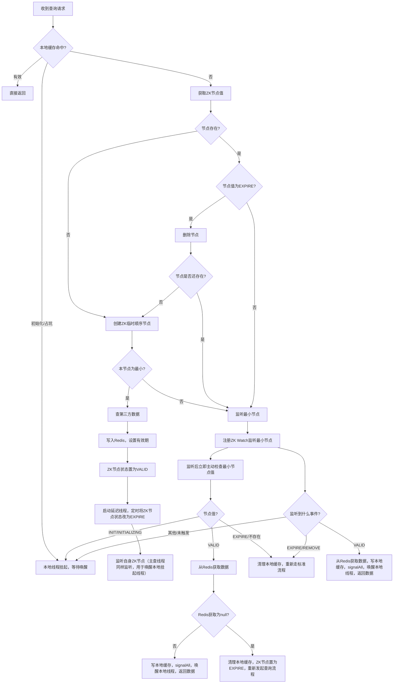

# 高并发查询场景下基于Zookeeper+Redis的分布式一致性缓存设计方案

## 🎯 背景与目标
在微服务集群环境中，部分高价值、高延迟的第三方查询接口会被频繁并发访问。为了避免缓存穿透、降低对外部服务的压力，并确保集群内数据一致性与高可用性，需设计一种高效的分布式一致性缓存方案，确保“同一查询key在全集群范围内同一时刻只触发一次第三方查询”。
本方案采用本地缓存、Zookeeper分布式锁、Redis分布式缓存三者协同，最大化查询性能与一致性，并避免并发场景下的“缓存雪崩”、“羊群效应”等问题。

## 🔧 核心流程与控制点
1. 本地缓存优先
  - 每台服务器维护本地缓存，命中且有效直接返回结果，极大提升查询性能。
  - 本地缓存记录状态（如：初始化/有效/过期），配合线程挂起与唤醒机制（如ReentrantLock+Condition），避免同一台服务器内同key重复请求。

2. Zookeeper分布式锁协作与节点状态判断
  - 当本地缓存未命中时，进入分布式锁流程，首先尝试获取ZK节点数据：
    - 节点不存在（如getData抛出NoNode异常）：说明当前没有任何线程在处理该key，当前线程可直接创建ZK临时顺序节点，进入锁竞争及数据查询流程。
    - 节点存在：则需判断节点值（状态）：
      - 若为EXPIRE，则先删除该节点。删除后需要判断节点是否还存在（并发下其他线程可能已新建节点），如果节点不存在则本线程创建节点，进入锁竞争流程；如果节点已存在，则直接监听最小节点。
      - 若为非EXPIRE，说明已有线程正在处理或已处理，无需再判断节点是否存在，直接监听最小节点，等待状态变为VALID。
  - 节点状态流转：
    - INITIALIZING（初始化，占坑）→ VALID（有效，缓存已就绪）→ EXPIRE（过期，需重新查询）。
  - 集群中获取到ZK分布式锁的服务器线程，作为“主查节点”，负责：
    - 查询第三方数据，将结果写入Redis，并设置有效期；
    - 修改ZK最小临时节点状态为VALID；
    - 自身也监听ZK节点的状态变更（如VALID），与其他线程逻辑一致：监听到后从Redis获取数据，写入本地缓存并signalAll唤醒本地线程。
   
3. 节点过期控制与自动恢复
  - 锁拥有者线程在设置ZK节点为VALID后，额外启动一个延迟线程，在Redis缓存有效期即将到期前，自动将ZK路径最小节点状态置为EXPIRE，驱动后续请求以标准流程重新获取数据，保证缓存与业务数据时效性对齐。
  - 
4. 监听与竞态窗口兜底机制
  - 获取分布式锁失败的线程（即不是ZK最小节点的线程），需监听最小节点的状态变更（ZK Watch）。
  - 注册监听后，立即主动检查节点当前值，避免监听窗口竞态导致事件丢失。
  - 主动检查最小节点值时，分为以下几种情况：
    - INIT/INITIALIZING：说明数据尚未可用，线程应挂起（await），等待被signal。
    - VALID：数据已就绪，直接从Redis取数据。此时需判断Redis拉取结果是否为null，如果为null（极端情况下Redis缓存已过期或被异常清理），则清理本地缓存、将ZK节点置为EXPIRE，并重新发起标准查询流程；否则写入本地缓存，signalAll唤醒本地线程并返回数据。
    - EXPIRE：数据已过期或异常，需删除本地缓存，重新走完整标准流程（即从ZK分布式锁开始）。
    - 节点不存在：极端异常，视同EXPIRE处理，删除本地缓存，重新走标准流程。
  - 所有监听到VALID事件的线程，可直接从Redis拉取数据，写入本地缓存，并signalAll唤醒本地所有挂起线程。此时Redis理论上一定有数据，无需判断null。
  - 监听到EXPIRE或REMOVE（节点被删除）事件时，必须清理本地缓存，并重新发起标准分布式查询流程。
5. 极端与异常场景自愈
  - 极端情况下，当获取锁失败的线程主动检查到ZK最小节点值为VALID后，若从Redis拉取数据为null（如Redis缓存已过期或被异常清理），则应主动清理本地缓存，并将ZK节点状态置为EXPIRE，然后重新发起完整查询流程，确保数据最终一致性。
  - 通常情况下，监听到ZK节点变为VALID时Redis数据已就绪，无需额外处理。

## 整体流程图（最终优化版）

- 说明：
  - 只有“主动检查最小节点值为VALID”时，需要判断Redis获取是否为null并处理极端情况（如缓存已过期/被清理）。
  - 监听到VALID事件时，数据理论上已写入Redis，此时直接拉取并返回，无需特殊null判断。
  - 监听到EXPIRE或REMOVE事件时，清理本地缓存，重启流程。

## 关键技术要点与优势
1. 高效阻断并发穿透：同一key同一时间仅一台服务器、一个线程对外查询，极大降低外部接口压力。
2. 多级缓存协作：本地缓存+Redis分布式缓存，结合ZK节点状态分流并发，命中率高、性能好。
3. 缓存时效性与主动过期：通过ZK节点配合延迟机制主动推进缓存过期，确保数据与业务时效强一致。
4. 监听+主动检查双保险：防止ZK事件遗漏，确保所有线程都能及时感知数据可用并获取结果。
5. 监听到EXPIRE/REMOVE事件主动清理缓存：防止脏数据，确保新一轮查询流程及时发起。
6. 极端场景处理与一致性保障：获取锁失败的线程主动检查到ZK节点为VALID时，若Redis数据已失效，则可自动自愈，避免数据雪崩或一致性丢失。
7. 线程安全与资源高效利用：本地线程挂起/唤醒机制配合分布式锁，最大限度减少线程/连接资源消耗。

## 参考实现要点
- 本地缓存推荐使用如ConcurrentHashMap，并针对每个key配套唯一WaitObject（含Lock/Condition等）。
- Zookeeper节点建议采用临时顺序节点，并保证清理过期/异常节点。
- Redis写入需设置合理过期时间，并关注分布式一致性与可用性。
- ZK节点监听和状态变更务必做好幂等和异常处理，防止遗漏通知或节点泄漏。
- 监听最小节点时，务必在注册监听后立即主动检查节点当前值，防止事件丢失导致线程死等。
- 监听到EXPIRE/REMOVE事件时，务必清理本地缓存并重启完整流程。

## 可优化细节建议
1. Zookeeper节点“膨胀”与清理
  - **问题**：高并发下ZK顺序节点可能短时间内膨胀，虽然临时节点会自动释放，但如果有异常线程未正常释放，可能产生“僵尸节点”。
  - **优化**：可以定期增加后台守护线程，对无效节点做主动清理，并配合监控告警。
2. 本地缓存的精细管理
  - **建议**：本地缓存可增加LRU或定期清理机制，防止“热点key”退潮后占用内存不释放。
  - **可选**：支持多级本地缓存（如Caffeine+Map）或弱引用，避免内存泄漏。
3. 监控与告警
  - **建议**：为Redis/ZK的异常、缓存击穿、主动自愈次数等核心指标增加监控告警，便于及时发现问题。
4. 限流和降级
  - 高并发场景下，加入对第三方服务的**限流保护**和**自动降级**机制，防止极端情况下外部依赖雪崩。
5. 重试与幂等
  - 对于第三方接口调用、ZK/Redis操作结果未达预期时，增加合理的重试与回滚机制，确保幂等性和最终一致性。
6. 优化ZK监听窗口
  - 可考虑ZK监听注册后，**增加短暂的自旋+睡眠重查机制**，进一步降低窗口期事件丢失概率。

## 结语
本方案有效应对分布式高并发场景下的热点查询缓存一致性问题，具备高可用、强一致、高性能特点。可广泛应用于金融、支付、风控等对查询一致性要求极高的业务领域。
