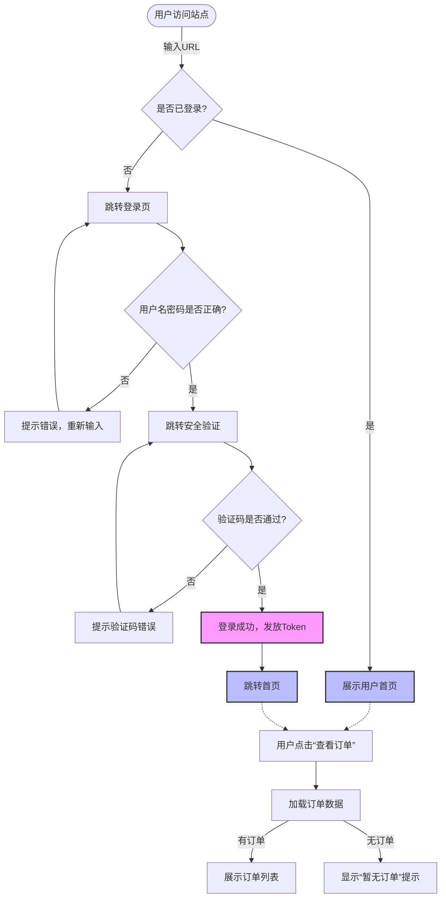

```mermaid
flowchart TD
    A([用户访问站点]) -->|输入URL| B{是否已登录?}
    B -- 是 --> C[展示用户首页]
    B -- 否 --> D[跳转登录页]
    D --> E{用户名密码是否正确?}
    E -- 否 --> F[提示错误，重新输入]
    F --> D
    E -- 是 --> G[跳转安全验证]
    G --> H{验证码是否通过?}
    H -- 否 --> I[提示验证码错误]
    I --> G
    H -- 是 --> J[登录成功，发放Token]
    J --> K[跳转首页]
    C -.-> L[用户点击“查看订单”]
    K -.-> L
    L --> M[加载订单数据]
    M -->|有订单| N[展示订单列表]
    M -->|无订单| O[显示“暂无订单”提示]
    style C fill:#bbf,stroke:#333,stroke-width:2px
    style K fill:#bbf,stroke:#333,stroke-width:2px
    classDef highlight fill:#f9f,stroke:#333,stroke-width:2px;
    class J highlight;
    %% 注释：这个流程涵盖了登录、校验和业务分支
```
